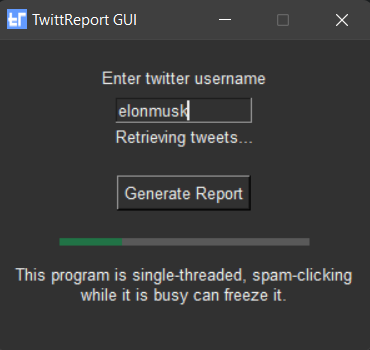

# TwittReport
2022 DeerHacks Entry - Get a report based on your (or someone else's) tweets.
<p align="center">
  
</p>

Get a fancy pdf report of your twitter activity.
Includes a GUI frontend.

Libraries used:
* twint - Scrape tweets
* spacy - Analyze tweets
* tkinter - GUI
* matplotlib - Cool graphics
* numpy / pandas - Required by matplotlib
* LaTeX / pdflatex - Generate a pdf

Theme used:\
 https://github.com/rdbende/Forest-ttk-theme
 
 ## Usage ##
 ```
python generate_report.py USERNAME
```
OR
 ```
python gui.py
```
For graphical interface:
<p align="center">
  
</p>

### Dependencies ###
* twint
* spacy
* tkinter (optional)
* matplotlib
* numpy
* pandas
* pdflatex

Also note that GTK3 is required for pdflatex to work on Windows. Some extra pip dependencies may be required by twint and spacy (google-able).
